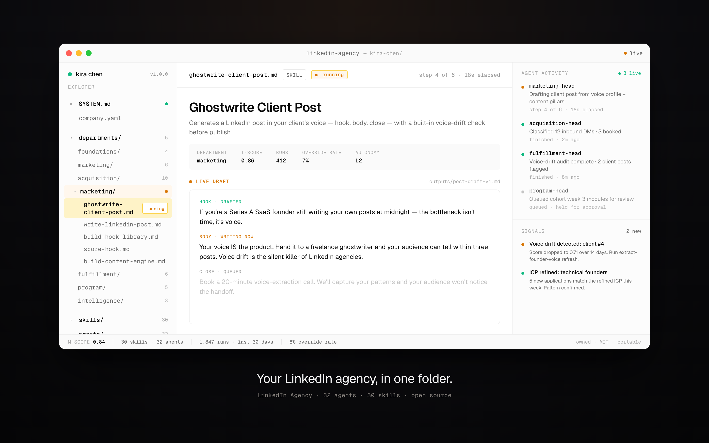

<div align="center">

<picture>
  <source media="(prefers-color-scheme: dark)" srcset="docs/assets/heuresis-logo-dark.png">
  <source media="(prefers-color-scheme: light)" srcset="docs/assets/heuresis-logo-light.png">
  
</picture>

<br/><br/>

<h1>LinkedIn Agency</h1>

<p><strong>Your B2B LinkedIn agency, encoded.</strong></p>

<p>
  <a href="CHANGELOG.md"></a>
  <a href="LICENSE"></a>
  <a href="https://heuresis.ai"></a>
</p>

</div>

<br/>



<p align="center"><em>Your LinkedIn agency, in one folder.</em></p>

---

## What is this?

A B2B LinkedIn agency has departments — voice, content, outbound DMs, fulfillment, and a high-ticket program for clients who outgrow the retainer. **LinkedIn Agency is that whole org chart, written down as a folder of plain files** any AI can read and run.

## How do I use it?

Hand this repo to your AI agent — Claude, ChatGPT, Cursor, whatever you use — and tell it to set itself up. Then just talk to it. It learns your agency and your client and guides you from there: ask it to extract a client's voice, write a week of posts, or run the daily DM pipeline.

No setup ceremony. You talk, it works.

---

## How it fits together

Every Heuresis workspace is the same shape — a boot layer reads your agency context, then runs the org chart, the skills, the reference brain, and the trigger manifest.

```text
┌──────────────────────────────────────────────────────────────┐
│                    THE ENCODED WORKSPACE                     │
│                                                              │
│  ┌───────────┐  ┌───────────┐  ┌───────────┐  ┌───────────┐  │
│  │ SYSTEM.md │  │ ENCODING  │  │ INVARIANTS│  │  company  │  │
│  │ boot file │  │  schema   │  │   rules   │  │  context  │  │
│  └───────────┘  └───────────┘  └───────────┘  └───────────┘  │
│                                                              │
│  ┌───────────┐  ┌───────────┐  ┌───────────┐  ┌───────────┐  │
│  │  agents/  │  │  skills/  │  │ reference/│  │  triggers │  │
│  │ org chart │  │  outputs  │  │   brain   │  │  manifest │  │
│  └───────────┘  └───────────┘  └───────────┘  └───────────┘  │
└──────────────────────────────────────────────────────────────┘
                            │
                            ▼
        any agent runtime that reads files — 11 ship
```

<br/>

---

## What's inside the folder

```text
linkedin-agency/
│
├── README.md            ←  the pitch
├── SYSTEM.md            ←  boot file · any AI becomes a LinkedIn agency operator
├── INVARIANTS.md        ←  14 NEVERs + 14 ALWAYSes (sacred rules)
├── ENCODING.md          ←  6-profile schema (agency + per-client)
├── company.yaml         ←  YOUR agency · fill once
│
├── agents/              ←  32 specialists · an org chart of a real agency
│      agency-director              top orchestrator
│      foundations-head             voice · ICP · positioning · offer
│      marketing-head               content engine · ghostwriting · virality
│      acquisition-head             outbound DMs · application gate · sales calls
│      fulfillment-head             DFY delivery · voice-drift audit · client reports
│      program-head                 curriculum · cohort cadence · student success
│
├── skills/              ←  30 capabilities · each produces one asset
│   │
│   │   FOUNDATIONS
│   ├── /extract-founder-voice       Voice profile (yours or a client's)
│   ├── /build-icp                   Ideal Customer Profile
│   ├── /design-retainer-offer       DFY service offer document
│   └── /design-program-offer        High-ticket program offer document
│   │
│   │   MARKETING
│   ├── /build-content-engine        Pillars, hook library, calendar
│   ├── /write-linkedin-post         Founder post (your own LinkedIn)
│   ├── /ghostwrite-client-post      Client-bound post (with voice-drift check)
│   ├── /build-hook-library          50+ hook templates per voice
│   ├── /build-posting-calendar      30-day editorial calendar
│   └── /score-hook                  Hook scorecard before publishing
│   │
│   │   ACQUISITION
│   ├── /build-outbound-engine       DM intent taxonomy + per-class sequence
│   ├── /write-dm-sequence           4-class DM sequences
│   ├── /classify-dm-intent          Auto-route inbound replies
│   ├── /build-qualification-thread  Multi-message qualification flow
│   ├── /build-application           Application with hard-DQ logic
│   ├── /triage-application          Score + sort applications
│   ├── /source-lead-list            ICP-precise, intent-scored prospect list
│   ├── /score-lead-intent           Pre-DM intent score per prospect
│   ├── /build-call-prep             Discovery call prep doc
│   ├── /summarize-discovery-call    Post-call summary + follow-up draft
│   └── /no-show-recovery            Re-engagement after a no-show
│   │
│   │   FULFILLMENT
│   ├── /onboard-client              First-30-days client onboarding
│   ├── /voice-drift-detector        Weekly per-client voice audit
│   ├── /post-approval-tracker       Client approval workflow tracker
│   ├── /run-client-dm-ops           Daily VA-driven client DM cycle
│   ├── /build-client-report         Monthly client report
│   └── /build-attribution-trace     Lead-to-revenue trace per client
│   │
│   │   PROGRAM
│   ├── /onboard-program-student     Student onboarding (cohort start)
│   ├── /program-cohort-pulse        Weekly cohort health check
│   ├── /build-curriculum            Curriculum module
│   ├── /build-first-win-trigger     Engineer the student's first measurable win
│   └── /build-retention-pulse       Retention check (program-side)
│
└── reference/           ←  the brain that makes skills smart
    ├── frameworks/             ICP · voice · content · DM · offer · fulfillment frameworks
    ├── operators/              anonymized archetype playbooks
    ├── platforms/              LinkedIn · X · IG · YouTube · email playbooks
    ├── playbooks/              multi-step playbook (24-month arc)
    ├── swipe-file/             annotated high-performer LinkedIn posts
    ├── templates/              output templates (proposal · onboarding · report)
    └── verticals/              vertical adaptations (SaaS · services · e-com · info-product)
```

Each file is plain text. Each folder is owned by you. Nothing is locked behind an app.

<br/>

---

## Each client ships with

- **Voice profile** — extracted in week 1, ship-grade
- **ICP** — per-client, in verbatim voice-of-customer language
- **Content engine** — pillars, hook library, posting calendar
- **DM engine** — 4-class intent taxonomy, per-intent sequences, booking-gate qualification
- **Lead list** — ICP-precise, intent-scored, prioritized
- **Discovery call prep** — research-deep, objections pre-framed
- **Retainer proposal** — named mechanism, value stack
- **Monthly report** — signal-dense, attribution-clean
- **Voice-drift audit** — weekly, per client

Every post passes the drift check. Every client's profile gets sharper each cycle.

<br/>

---

## Runs while you sleep

Wire the workspace to a scheduler and the agents keep working without you in the room — queuing each client's posts every morning, routing inbound DMs to the right sequence, and running a voice-drift check across every client each week. Triggers live in [`paperclip.manifest.yaml`](paperclip.manifest.yaml).

<br/>

---

## What you get

Five departments, ready to run:

- **Foundations** — voice extraction · ICP build · positioning · offer architecture
- **Marketing** — content engine · hook library · per-client ghostwriting · repurposing
- **Acquisition** — outbound DM engine · 4-class intent taxonomy · application gate · call prep · closing · follow-up
- **Fulfillment** — account management · ghostwriting protocol · client DM ops · lead-list sourcing · monthly reporting · voice-drift detection
- **Program** — curriculum design · mentorship cadence · community rituals · first-win engineering · retention pulse

<br/>

---

## Multi-tool integrations

It's just files, so it runs in any major AI tool — no lock-in, no rewrite.

| Tool | Install |
|---|---|
| **Claude Code** | `./scripts/install.sh --tool claude-code` |
| **GitHub Copilot** | `./scripts/install.sh --tool copilot` |
| **Antigravity (Gemini)** | `./scripts/install.sh --tool antigravity` |
| **Gemini CLI** | `./scripts/install.sh --tool gemini-cli` |
| **OpenCode** | `./scripts/install.sh --tool opencode` |
| **Cursor** | `./scripts/install.sh --tool cursor` |
| **Aider** | `./scripts/install.sh --tool aider` |
| **Windsurf** | `./scripts/install.sh --tool windsurf` |
| **OpenClaw** | `./scripts/install.sh --tool openclaw` |
| **Qwen Code** | `./scripts/install.sh --tool qwen` |
| **Kimi Code** | `./scripts/install.sh --tool kimi` |

Full details per tool: **[integrations/README.md](integrations/README.md)**.

<br/>

---

## Documentation

- [Quickstart](docs/QUICKSTART.md) — setup in 30 minutes
- [Architecture](docs/ARCHITECTURE.md) — how the folder is built
- [Skill Authoring](docs/SKILL_AUTHORING.md) — write your own agents and skills

## License

**Heuresis Source License 1.0** — see [LICENSE](LICENSE). Free for solo developers, learning, and testing. Company use, client work, or anything resold: email [Syed@heuresis.ai](mailto:Syed@heuresis.ai) first.

Built by [Syed Hussain](https://heuresis.ai) at [Heuresis](https://heuresis.ai).
