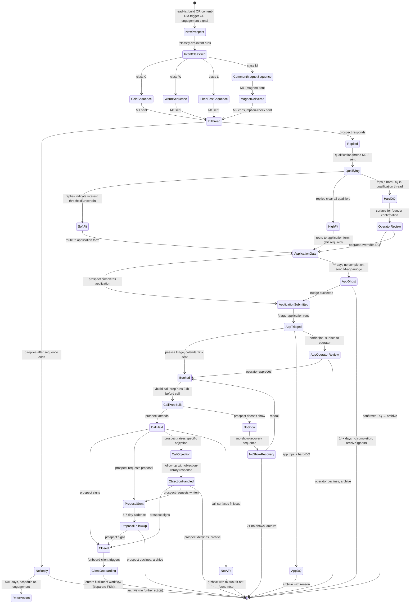

# Acquisition Workflow — FSM

> The state machine for every prospect entering the acquisition pipeline, from "stranger" to "signed client" or "disqualified." Owned by `acquisition-head`. Drives `paperclip.manifest.yaml` triggers and per-stage skill execution.

## State diagram

## State definitions

| State | Definition | Owner | Auto-transition? |
|---|---|---|---|
| **NewProspect** | Identified, not yet contacted | lead-list-builder OR content engine | YES — to IntentClassified |
| **IntentClassified** | Classifier has assigned class C/W/L/M | dm-strategist | YES — to class-specific sequence |
| **ColdSequence** | In Class-C 5-7 message sequence | dm-strategist | YES through messages |
| **WarmSequence** | In Class-W 3-5 message sequence | dm-strategist | YES |
| **LikedPostSequence** | In Class-L 2-4 message sequence | dm-strategist | YES |
| **CommentMagnetSequence** | In Class-M 3-5 message sequence | dm-strategist | YES |
| **MagnetDelivered** | Class-M only: magnet sent in M1 | dm-strategist | YES — to InThread on M2 |
| **InThread** | Sequence active, awaiting reply OR sequence end | dm-strategist | NO — manual or reply-driven |
| **Replied** | Prospect has replied | dm-strategist | NO — manual triage |
| **Qualifying** | Qualification thread active (M2-3 of post-reply) | dm-strategist | NO |
| **SoftFit** | Some signals positive, some uncertain | dm-strategist | YES — to ApplicationGate |
| **HighFit** | All qualifiers passed | dm-strategist | YES — to ApplicationGate |
| **HardDQ** | Tripped a hard-DQ in qualification thread | dm-strategist | YES — to OperatorReview (per `INVARIANTS.md` A-13) |
| **OperatorReview** | Operator confirms DQ or overrides | acquisition-head + operator | NO — operator-driven |
| **ApplicationGate** | Calendar gated behind application form | acquisition-head | NO — prospect-driven |
| **ApplicationSubmitted** | Form completed | acquisition-head | YES — to AppTriaged |
| **AppGhost** | App link sent, no completion in 7d | acquisition-head | YES — to nudge OR archive |
| **AppTriaged** | `/triage-application` has run | acquisition-head | YES — to one of three states |
| **Booked** | Calendar booked, call upcoming | acquisition-head | YES — to CallPrepBuilt |
| **CallPrepBuilt** | `/build-call-prep` has produced prep doc | call-prep-specialist | NO — call-time-driven |
| **CallHeld** | Operator and prospect on call | acquisition-head + operator | NO — call-driven |
| **NoShow** | Prospect didn't attend | acquisition-head | YES — to NoShowRecovery |
| **NoShowRecovery** | `/no-show-recovery` running | call-prep-specialist | NO |
| **CallObjection** | Specific objection raised | acquisition-head | NO — operator-driven |
| **ObjectionHandled** | Objection-library response sent | acquisition-head | NO — prospect-reply-driven |
| **ProposalSent** | Written proposal delivered | offer-architect + acquisition-head | NO |
| **ProposalFollowUp** | Cadence active | acquisition-head | NO |
| **Closed** | Contract signed, payment processing | acquisition-head + operator | YES — to ClientOnboarding |
| **ClientOnboarding** | `/onboard-client` triggered | account-manager | YES — exits to Fulfillment FSM |
| **NotAFit** | Mutual decision not to proceed | acquisition-head + operator | YES — archive |

## Triggers (cross-reference to paperclip.manifest.yaml)

- `lead.applied` (webhook) → ApplicationSubmitted state
- `dm.replied` (webhook) → Replied state, fires `/classify-dm-intent` if not classified
- `call.ended` (webhook) → CallHeld → triggers `/summarize-discovery-call`
- `dm.no-reply.7d` (cron) → moves InThread to NoReply for sequences past their length
- `app.no-completion.7d` (cron) → moves ApplicationGate to AppGhost

## Owner-by-state escalation

States where the operator MUST be in the loop (per `INVARIANTS.md` A-13):
- HardDQ → OperatorReview
- AppOperatorReview
- CallHeld (operator runs the call)
- ProposalSent (operator confirms before send)
- Closed (operator countersigns)

All other states can run on workspace + VA without operator review per the handoff protocol in `/build-outbound-engine`.

## Health metrics by state

| Stage | Metric | Healthy range | Action if below |
|---|---|---|---|
| ColdSequence | Reply rate | 8-15% | Audit M1 personalization + ICP-list match |
| WarmSequence | Reply rate | 25-45% | Audit specificity of engagement-reference |
| LikedPostSequence | Reply rate | 50-70% | Audit speed (M1 within 24h?) |
| CommentMagnetSequence | M1 delivery time | <1 hour | Check ManyChat / automation |
| Qualifying | Conversion to ApplicationGate | 40-60% | Audit qualification thread structure |
| ApplicationGate | Application completion rate | 30-50% | Audit application length / friction |
| Booked → CallHeld | Show rate | 75-90% | Audit qualification thread (calendar leak) |
| CallHeld → Closed | Close rate | 30-50% | Audit call structure + offer clarity |
| Closed | Average deal size | per offer pricing | Audit pricing-anchor effectiveness |

## Cross-references

- `agents/acquisition-head.md` — owner of this FSM
- `agents/dm-strategist.md` — runs the DM-state portion
- `agents/call-prep-specialist.md` — runs the CallPrepBuilt → CallHeld transition
- `skills/build-outbound-engine/SKILL.md` — populates the state machine config
- `reference/frameworks/dm/intent-taxonomy.md` — class definitions
- `reference/frameworks/dm/qualification-thread-design.md` — Qualifying state logic
- `reference/frameworks/dm/booking-gate-construction.md` — ApplicationGate logic
- `paperclip.manifest.yaml` — webhook + cron triggers that drive state transitions
- `INVARIANTS.md` A-13, N-12 — operator-in-loop on hard DQs + application required

---

*Workflow version 1.0.0 — 2026-05-03*
