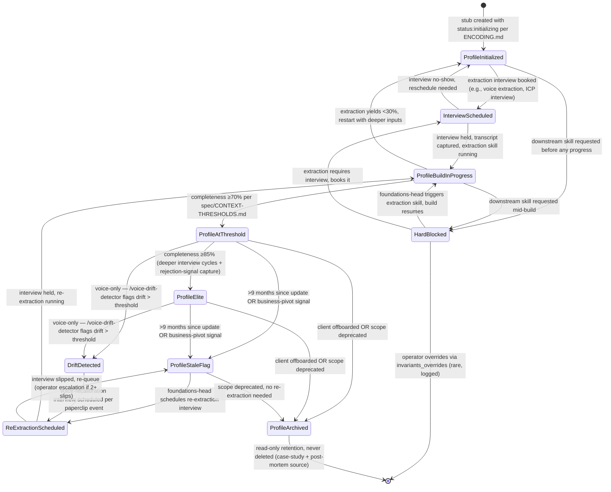

# Foundations Workflow — FSM

> The state machine for every foundation profile (voice, ICP, positioning, offer, mission), per scope (agency-level OR per-client), from "initialized" through "elite" through "stale → re-extracted." Owned by `foundations-head`. Profiles are load-bearing — every downstream skill gates against the threshold states defined here, per `INVARIANTS.md` A-5 and `spec/CONTEXT-THRESHOLDS.md`.

## State diagram

## State definitions

| State | Definition | Owner | Auto-transition? |
|---|---|---|---|
| **ProfileInitialized** | Stub created in `company.yaml` per `ENCODING.md` with `status: initializing, completeness: 0` | foundations-head | NO — interview-driven |
| **InterviewScheduled** | Extraction interview on calendar (voice extraction, ICP interview, offer-architect session, positioning workshop, mission articulation) | foundations-head + voice-extractor / icp-builder / offer-architect | NO — interview-time-driven |
| **ProfileBuildInProgress** | Interview transcript captured; extraction skill (e.g., `/extract-founder-voice`, `/build-icp`, `/design-retainer-offer`, `/build-positioning`, `/define-mission`) running | specialist (per profile) | YES — to ProfileAtThreshold or back to ProfileInitialized |
| **ProfileAtThreshold** | Completeness ≥70% — unlocks downstream skills at standard quality per `spec/CONTEXT-THRESHOLDS.md` | foundations-head | NO — refinement-driven |
| **ProfileElite** | Completeness ≥85% — unlocks all dependents at full quality; client-bound ghostwriting can ship with operator review only per Context Quality tier "Elite" in `SYSTEM.md` | foundations-head | NO — staleness-cron-driven |
| **ProfileStaleFlag** | >9 months since last refinement OR business-pivot signal detected (e.g., new offer launch, ICP shift in closed-deal evidence) | foundations-head | YES — to ReExtractionScheduled |
| **ReExtractionScheduled** | Re-extraction interview booked; old profile retained until new extraction validated | foundations-head + specialist | NO — interview-time-driven |
| **DriftDetected** | Voice profiles only — `/voice-drift-detector` cosine score below `voice_drift_threshold` per `paperclip.manifest.yaml` voice-drift-threshold-breached event | voice-extractor | YES — to ReExtractionScheduled, ghostwriting paused per N-2 |
| **HardBlocked** | Downstream skill refused execution because profile sub-threshold per `INVARIANTS.md` N-1, A-5 — surfaced to operator with explicit upstream-fix recommendation | foundations-head | NO — operator + foundations-head decision |
| **ProfileArchived** | Client offboarded OR scope deprecated; profile read-only, retained for case-study + post-mortem source per A-10 | foundations-head | YES — exit (terminal but never deleted) |

## Per-scope conditional logic

Foundations profiles are **recursive** — they exist at two scopes:

- **Agency scope:** one set of profiles for the agency operator (e.g., `brand_voice.agency_voice`, `ideal_customer_profile.agency_icp`, `product_strategy.service_tier`, `business_context.positioning`, `business_context.mission`).
- **Per-client scope:** one set of subprofiles per active client, keyed by `client_slug` (e.g., `brand_voice.client_voices.{slug}`, `ideal_customer_profile.client_icps.{slug}`, `content_strategy.client_content.{slug}`).

The FSM applies per-instance:

- Agency-scope profiles initialize once at workspace setup; transition through the same states with longer cadence (re-extraction every 9-12 months unless pivot).
- Per-client subprofiles initialize on `case_studies.agency_case_studies.added` event (per `paperclip.manifest.yaml` `new-client-signed`) and run through the FSM independently per client.
- `DriftDetected` runs weekly per active client per `paperclip.manifest.yaml` `weekly-voice-drift-audit` cron — agency-voice drift checked at lower cadence (monthly).
- `HardBlocked` for client-bound work checks the *client* subprofile, not the agency profile, per A-6 (client subprofiles are load-bearing).
- `ProfileArchived` for per-client subprofiles fires on client offboarding; agency-scope profiles archive only on workspace decommission.

## Triggers (cross-reference to paperclip.manifest.yaml)

- `case_studies.agency_case_studies.added` (event: `new-client-signed`) → fires `/onboard-client` which creates `ProfileInitialized` stubs across `brand_voice.client_voices`, `ideal_customer_profile.client_icps`, `content_strategy.client_content` per client_slug
- `weekly-voice-drift-audit` (cron: Monday 09:00, scope all-active-clients) → fires `/voice-drift-detector` → DriftDetected transition if score below threshold
- `voice-drift-threshold-breached` (event from `/voice-drift-detector`) → fires `/trigger-voice-recalibration` → DriftDetected → ReExtractionScheduled, ghostwriting paused
- `profile.staleness.9-months` (cron per profile) → ProfileAtThreshold or ProfileElite → ProfileStaleFlag
- downstream-skill gate-check failure (any skill load) → HardBlocked surfaced with diagnostic

## Owner-by-state escalation

States where the operator MUST be in the loop (per foundations-head escalation path + `INVARIANTS.md`):

- HardBlocked (operator decides: fix upstream now vs. invariants_overrides log entry — almost always the former)
- ReExtractionScheduled with 2+ slips (operator escalation per foundations-head escalation path: "operator repeatedly skips the foundation interview")
- ProfileStaleFlag triggered by business-pivot signal (operator confirms pivot scope — agency vs. per-client — before re-extraction begins)
- ProfileArchived for active-client scope (operator countersigns offboarding decision)
- DriftDetected with severe score (operator + foundations-head jointly approve recalibration cadence and ghostwriter retraining)

All other states run on foundations-head + specialist with operator informed via context-quality-tier declarations per A-7.

## Health metrics by state

| Stage | Metric | Healthy range | Action if below |
|---|---|---|---|
| ProfileInitialized → InterviewScheduled | Time to interview booked | <7 days (agency); <14 days (per-client) | Audit calendar friction; escalate per foundations-head failure mode "operator repeatedly skips" |
| InterviewScheduled → ProfileBuildInProgress | Interview-held rate | ≥90% | Audit no-show pattern; reschedule with shorter window |
| ProfileBuildInProgress → ProfileAtThreshold | Time to ≥70% | <14 days (agency); <21 days (per-client) | Audit interview depth; check `voice_of_customer` source quality (require unguarded transcripts per foundations-head guard) |
| ProfileAtThreshold → ProfileElite | Time to ≥85% | <90 days (agency); <120 days (per-client) | Audit rejection-signal capture per A-9; verify pattern updates feeding back to profile |
| ProfileElite | Time at ≥85% before stale | ≥9 months sustained | If <9 months, audit pivot frequency vs. core-thesis stability |
| DriftDetected | Frequency per client per quarter | ≤1 event | If >1, audit ghostwriter calibration; trigger more frequent recalibration interviews |
| ReExtractionScheduled | Time to interview held | <14 days | Operator escalation per foundations-head if slipped |
| HardBlocked | Frequency per quarter | ≤2 per scope | If >2, audit which downstream skills repeatedly outpace foundation cadence; rebalance Phase resource allocation per `reference/playbooks/hybrid-full-stack.md` |
| ProfileArchived | Time from client-offboard to archive | <7 days | Audit offboarding workflow handoff to foundations-head |

## Cross-references

- `agents/foundations-head.md` — owner of this FSM
- `agents/voice-extractor.md` — runs voice-profile portion (build + drift + re-extraction)
- `agents/icp-builder.md` — runs ICP-profile portion
- `agents/offer-architect.md` — runs offer + product-strategy portion
- `skills/extract-founder-voice/SKILL.md` — primary build skill for brand_voice profiles
- `skills/build-icp/SKILL.md` — primary build skill for ideal_customer_profile profiles
- `skills/design-retainer-offer/SKILL.md` — primary build skill for product_strategy.service_tier
- `skills/design-program-offer/SKILL.md` — primary build skill for product_strategy.program_tier
- `skills/build-positioning/SKILL.md` — agency-scope positioning
- `skills/define-mission/SKILL.md` — agency-scope mission
- `skills/voice-drift-detector/SKILL.md` — DriftDetected detection logic
- `skills/onboard-client/SKILL.md` — creates per-client ProfileInitialized stubs
- `ENCODING.md` — 6-profile schema + `status: initializing` semantics
- `spec/CONTEXT-THRESHOLDS.md` — the 70% / 85% gate values per skill per profile
- `INVARIANTS.md` N-1 (no client ghostwriting below voice 75%), N-2 (drift detector mandatory), A-5 (dependency chain), A-6 (client subprofiles load-bearing), A-9 (rejection signal feeds profile), A-12 (weekly drift audit)
- `paperclip.manifest.yaml` — `weekly-voice-drift-audit` cron + `voice-drift-threshold-breached` event + `new-client-signed` event

---

*Workflow version 1.0.0 — 2026-05-03*
