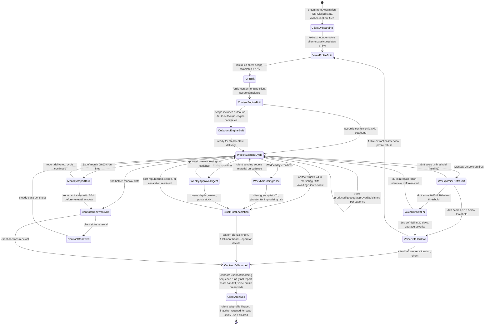

# Fulfillment Workflow — FSM

> The state machine for every paying client from onboarding through weekly content/DM cycles, monthly reporting, voice-drift recalibration, and renewal-or-offboard. Owned by `fulfillment-head`. Drives `paperclip.manifest.yaml` cron-cadence triggers and per-client recursive subprofile lifecycle.

## State diagram

## State definitions

| State | Definition | Owner | Auto-transition? |
|---|---|---|---|
| **ClientOnboarding** | Entry from Acquisition FSM Closed; `/onboard-client` triggered, subprofile stubs created | account-manager | YES — to VoiceProfileBuilt on extraction completion |
| **VoiceProfileBuilt** | Client-scope `brand_voice.client_voices[slug]` ≥75% via `/extract-founder-voice` | voice-extractor + account-manager | YES — to ICPBuilt |
| **ICPBuilt** | Client-scope `ideal_customer_profile.client_icps[slug]` ≥75% via `/build-icp` | icp-builder + account-manager | YES — to ContentEngineBuilt |
| **ContentEngineBuilt** | Client-scope `content_strategy.client_content[slug]` complete via `/build-content-engine` | content-strategist + account-manager | YES — to OutboundEngineBuilt or WeeklyContentCycle |
| **OutboundEngineBuilt** | Client-scope DM ops configured via `/build-outbound-engine` (only if scope includes outbound) | dm-strategist + account-manager | YES — to WeeklyContentCycle |
| **WeeklyContentCycle** | Steady-state: posts produced via marketing FSM, queued, approved, published per cadence | account-manager + linkedin-ghostwriter | NO — recurring, branches on cron triggers |
| **WeeklyVoiceDriftAudit** | Monday cron: `/voice-drift-detector` runs against last 20 ghostwritten posts vs. validated voice | account-manager | YES — branches by drift score |
| **WeeklySourcingPulse** | Wednesday cron: `/client-content-sourcing-pulse` checks raw-material flow from client | account-manager | YES — to WeeklyContentCycle or StuckPostEscalation |
| **WeeklyApprovalDigest** | Friday cron: `/post-approval-tracker` digest of pending-approval items | account-manager | YES — to WeeklyContentCycle or StuckPostEscalation |
| **MonthlyReportBuilt** | 1st-of-month cron: `/build-client-report` produces attribution-clean monthly report | client-reporter | YES — to WeeklyContentCycle or renewal cycle |
| **VoiceDriftSoftFail** | Drift score 0.05-0.10 below threshold; halt next 3 posts pending recalibration | fulfillment-head + account-manager | NO — recalibration-driven (per `INVARIANTS.md` N-2, A-12) |
| **VoiceDriftHardFail** | Drift score >0.10 below threshold; halt all posts, schedule full re-extraction | fulfillment-head + operator | NO — operator escalation required |
| **StuckPostEscalation** | Post >7 days stuck OR sourcing pulse missed OR approval queue choked | fulfillment-head | NO — operator/client-driven decision (republish, retire, or escalate) |
| **ContractRenewalCycle** | 60d before renewal: surface renewal brief with client metrics + retention rationale | fulfillment-head + operator | NO — operator-driven negotiation |
| **ContractRenewed** | Client signs renewal | fulfillment-head + operator | YES — back to WeeklyContentCycle |
| **ContractOffboarded** | Renewal declined OR voice-recalibration refused OR escalation churn | fulfillment-head + operator | YES — to ClientArchived |
| **ClientArchived** | Final report delivered, asset handoff complete, subprofile flagged inactive (preserved for potential case-study use per N-3 + A-11) | fulfillment-head | YES — exit FSM |

## Triggers (cross-reference to paperclip.manifest.yaml)

- `new-client-signed` (event) → fires `/onboard-client`, enters ClientOnboarding state
- `weekly-voice-drift-audit` (cron Mon 0900) → fires WeeklyVoiceDriftAudit per active client
- `daily-content-engine-queue` (cron daily 0600) → drives WeeklyContentCycle publishing cadence
- `client.content-source.arrived` (webhook) → keeps WeeklySourcingPulse healthy, populates marketing FSM Idea state
- `client.rejected-post` (webhook) → fires `/process-rejection-signal`, may trigger drift-pattern flag
- `voice-drift-threshold-breached` (event) → routes WeeklyVoiceDriftAudit to VoiceDriftSoftFail or VoiceDriftHardFail per severity
- `monthly-client-reports` (cron 1st of month 0900) → fires MonthlyReportBuilt
- `weekly-pipeline-pulse` (cron Mon 0800) → cross-reads StuckPostEscalation queue depth across clients

## Owner-by-state escalation

States where the operator MUST be in the loop (per `INVARIANTS.md` A-12, A-13, N-2, N-3):

- **VoiceDriftHardFail** — full re-extraction requires operator + client; cannot proceed on workspace alone
- **StuckPostEscalation** — fulfillment-head + operator decide republish/retire/escalate; >2 escalations in 30d signals churn risk per agent escalation path
- **ContractRenewalCycle** — operator owns the renewal conversation, fulfillment-head briefs
- **ContractOffboarded** — operator countersigns offboarding; preserves client relationship integrity
- **MonthlyReportBuilt** — operator reviews report before client delivery (no auto-send), per N-3 (no invented numbers) + A-11 (anonymized methodology in any case-study reuse)
- **WeeklyVoiceDriftAudit** failure — escalates to operator if same client soft-fails 2x in 30d (per fulfillment-head escalation path)

All other states (WeeklyContentCycle steady-state, sourcing pulse healthy, approval digest clearing) run on workspace + account-manager + ghostwriter without operator review.

## Health metrics by state

| Stage | Metric | Healthy range | Action if below |
|---|---|---|---|
| ClientOnboarding | Time to VoiceProfileBuilt | <14 days from signing | Audit onboarding interview cadence; surface scheduling friction |
| VoiceProfileBuilt | Voice profile completeness | ≥75% (gate) / target 85% | Schedule deeper extraction interview |
| ICPBuilt | ICP profile completeness | ≥75% (gate) / target 85% | Re-run `/build-icp` with sales-call transcripts |
| ContentEngineBuilt | Time from ICPBuilt to first published post | <7 days | Audit pillar definition friction or hook-library load |
| WeeklyContentCycle | Posts published per week vs. contract | 100% adherence | Audit sourcing pulse, ghostwriter capacity |
| WeeklyVoiceDriftAudit | Drift score | ≥ client `voice_drift_threshold` (default 0.82) | Soft-fail recalibration OR hard-fail re-extraction |
| WeeklySourcingPulse | Days since last client source material | <7 days | Surface to fulfillment-head; risk of ghostwriter improvisation |
| WeeklyApprovalDigest | Approval queue depth | <5 pending per client | Audit client review friction; restructure batching protocol |
| MonthlyReportBuilt | Calls booked tagged 'LinkedIn-sourced' | per offer's stated benchmark | Audit attribution trace, content-to-conversion bridge |
| VoiceDriftSoftFail | Recurrence in 30d | 0 (one and resolved) | If 2+, upgrade to VoiceDriftHardFail |
| VoiceDriftHardFail | Frequency per client | 0 in any rolling 90d | Pattern signals ghostwriter mis-fit OR voice profile too narrow |
| StuckPostEscalation | Frequency per client per month | <2 | Pattern signals client review failure OR sourcing collapse |
| ContractRenewalCycle | Renewal close rate | 70-85% | Audit attribution clarity in monthly reports; assess transformation visibility |
| ClientArchived | Mean client tenure | ≥9 months | If <6 months, audit onboarding gate + voice-drift cadence + reporting gate |

## Cross-references

- `agents/fulfillment-head.md` — owner of this FSM
- `agents/account-manager.md` — runs WeeklyContentCycle, drift audit, sourcing pulse, approval digest
- `agents/client-reporter.md` — runs MonthlyReportBuilt
- `agents/voice-extractor.md` — runs VoiceProfileBuilt and post-VoiceDriftHardFail re-extraction
- `agents/icp-builder.md` — runs ICPBuilt
- `agents/content-strategist.md` — runs ContentEngineBuilt
- `agents/dm-strategist.md` — runs OutboundEngineBuilt and `/run-client-dm-ops`
- `agents/linkedin-ghostwriter.md` — runs steady-state ghostwriting inside WeeklyContentCycle (handoff to marketing FSM)
- `skills/onboard-client/SKILL.md` — ClientOnboarding logic
- `skills/voice-drift-detector/SKILL.md` — WeeklyVoiceDriftAudit logic
- `skills/post-approval-tracker/SKILL.md` — WeeklyApprovalDigest logic
- `skills/client-content-sourcing-pulse/SKILL.md` — WeeklySourcingPulse logic
- `skills/build-client-report/SKILL.md` — MonthlyReportBuilt logic
- `skills/build-attribution-trace/SKILL.md` — feeds ContractRenewalCycle brief
- `workflows/divisions/marketing.md` — WeeklyContentCycle delegates per-post lifecycle to marketing FSM
- `workflows/divisions/acquisition.md` — Closed state hands off to ClientOnboarding here
- `reference/frameworks/fulfillment/voice-drift-detection.md` — drift threshold logic
- `reference/frameworks/fulfillment/account-mgmt-protocol.md` — weekly cadence rationale
- `reference/templates/client-onboarding-doc.md` — ClientOnboarding artifact
- `reference/templates/monthly-client-report.md` — MonthlyReportBuilt artifact
- `paperclip.manifest.yaml` — cron + webhook + event triggers that drive state transitions
- `INVARIANTS.md` N-1, N-2, N-3, N-6, A-6, A-11, A-12, A-13 — voice + drift + recursive context + escalation + anonymization rules

---

*Workflow version 1.0.0 — 2026-05-03*
