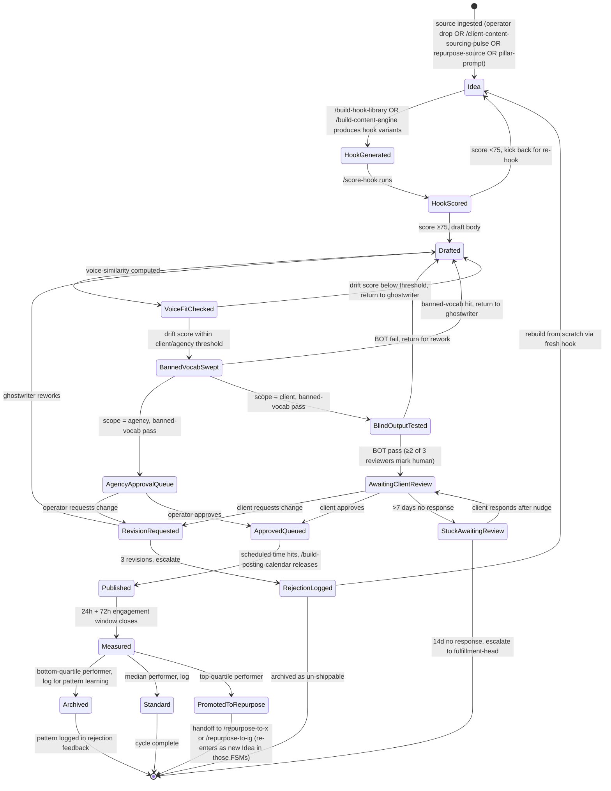

# Marketing Workflow — FSM

> The state machine for every content artifact moving from raw idea through publish-and-measure, across both agency-scope and client-scope (recursive). Owned by `marketing-head`. Drives `paperclip.manifest.yaml` content-queue triggers and the per-pillar production lifecycle.

## State diagram

## State definitions

| State | Definition | Owner | Auto-transition? |
|---|---|---|---|
| **Idea** | Raw input received: operator note, client voice-note, repurpose source, or pillar prompt | content-strategist | YES — to HookGenerated |
| **HookGenerated** | Hook variants drafted via `/build-hook-library` or `/build-content-engine` | hook-writer | YES — to HookScored |
| **HookScored** | `/score-hook` produced numeric score | hook-writer | YES — to Drafted (≥75) or back to Idea (<75) |
| **Drafted** | Post body produced by `/write-linkedin-post` (agency) or `/ghostwrite-client-post` (client) | linkedin-ghostwriter | YES — to VoiceFitChecked |
| **VoiceFitChecked** | `/voice-drift-detector` computed similarity vs. agency or client voice profile | linkedin-ghostwriter | YES — to BannedVocabSwept (pass) or back to Drafted (fail) |
| **BannedVocabSwept** | `spec/BANNED-VOCABULARY.md` hard-block sweep complete | linkedin-ghostwriter | YES — to next state by scope |
| **BlindOutputTested** | Client-scope only: BOT per `spec/BLIND-OUTPUT-TEST.md` complete | linkedin-ghostwriter + marketing-head | YES — to AwaitingClientReview (pass) or Drafted (fail) |
| **AwaitingClientReview** | Client-scope: artifact in `/post-approval-tracker` queue awaiting client sign-off | account-manager + client | NO — client-driven |
| **AgencyApprovalQueue** | Agency-scope: artifact awaiting operator sign-off | marketing-head + operator | NO — operator-driven |
| **RevisionRequested** | Reviewer (operator or client) flagged change | linkedin-ghostwriter | YES — to Drafted |
| **RejectionLogged** | 3+ revisions on same artifact, hard-stop | marketing-head | NO — escalation-driven |
| **StuckAwaitingReview** | Client review queue >7d without response | account-manager | NO — nudge-driven |
| **ApprovedQueued** | Sign-off received, scheduled in `/build-posting-calendar` | content-strategist | YES — to Published at scheduled time |
| **Published** | Live on LinkedIn (agency or client account) | content-strategist | YES — to Measured at 72h |
| **Measured** | Engagement captured at 24h + 72h, scored against pillar baseline | content-strategist | YES — to one of three buckets |
| **Archived** | Bottom-quartile performer; pattern logged for `phrases_to_avoid` and hook-decay audit | content-strategist | YES — exit |
| **Standard** | Median performer; logged for baseline reinforcement | content-strategist | YES — exit |
| **PromotedToRepurpose** | Top-quartile performer; handed to `/repurpose-to-x` and `/repurpose-to-ig` | content-strategist | YES — exits, re-enters those FSMs as Idea |

## Triggers (cross-reference to paperclip.manifest.yaml)

- `client.content-source.arrived` (webhook) → creates Idea state for client-scope artifact, fires `/process-client-source-material`
- `daily-content-engine-queue` (cron 0600 daily) → moves ApprovedQueued items to Published per calendar
- `weekly-voice-drift-audit` (cron Mon 0900) → re-evaluates last 5 client-scope Published items per active client; flags retroactive drift if any breach threshold
- `client.rejected-post` (webhook) → moves AwaitingClientReview → RevisionRequested, fires `/process-rejection-signal`
- `weekly-pipeline-pulse` (cron Mon 0800) → reads Measured-state archive to surface engagement trends per pillar

## Owner-by-state escalation

States where the operator MUST be in the loop (per `INVARIANTS.md` A-13, N-2, N-9):

- **AgencyApprovalQueue** — operator signs off on every agency-account post (no auto-publish to founder voice)
- **AwaitingClientReview** — client signs off per offer's `scope_guardrails`; account-manager mediates
- **RejectionLogged** — marketing-head + operator decide rebuild vs. archive
- **StuckAwaitingReview** (>14d) — fulfillment-head escalation, may signal client churn risk
- **VoiceFitChecked** (failure) — if drift fails on a client artifact 2x in a week, escalate to fulfillment-head per `INVARIANTS.md` A-12

All other states can run on workspace + ghostwriter without operator review per the handoff protocol in `/build-content-engine`.

## Health metrics by state

| Stage | Metric | Healthy range | Action if below |
|---|---|---|---|
| HookScored | Pass rate (score ≥75) | 60-80% | Audit hook library staleness, run `/audit-hook-library-decay` |
| VoiceFitChecked | Pass rate (no drift flag) | 85%+ for client, 90%+ for agency | Recalibrate ghostwriter; surface to fulfillment-head if client-scope |
| BannedVocabSwept | Hits per 100 drafts | <5 | Refresh ghostwriter on `spec/BANNED-VOCABULARY.md` |
| BlindOutputTested | Pass rate (≥2 of 3 reviewers human) | 80%+ | Voice profile re-extraction interview |
| AwaitingClientReview | Time-to-approval | <72h median | Audit client approval friction; restructure batching |
| RevisionRequested | Revisions per artifact | <1.3 average | Voice profile drift, escalate to fulfillment-head |
| Published | Posting cadence adherence | 95%+ vs. calendar | Audit content-sourcing pulse, queue depth |
| Measured | Median engagement per pillar | within 70-130% of pillar baseline | Pillar-weight audit, may trigger `/build-content-engine` refresh |
| PromotedToRepurpose | Top-quartile rate | 20-30% of Published | If <15%, audit hook library + pillar mix |

## Cross-references

- `agents/marketing-head.md` — owner of this FSM
- `agents/content-strategist.md` — runs the calendar/queue states
- `agents/hook-writer.md` — runs HookGenerated/HookScored
- `agents/linkedin-ghostwriter.md` — runs Drafted through BlindOutputTested
- `agents/account-manager.md` — runs AwaitingClientReview, escalates StuckAwaitingReview
- `skills/build-content-engine/SKILL.md` — populates pillar/hook/cadence config
- `skills/score-hook/SKILL.md` — HookScored gate logic
- `skills/voice-drift-detector/SKILL.md` — VoiceFitChecked logic
- `skills/post-approval-tracker/SKILL.md` — AwaitingClientReview queue mechanics
- `skills/repurpose-to-x/SKILL.md` and `/repurpose-to-ig` — PromotedToRepurpose handoff
- `reference/frameworks/content/hook-anatomy.md` — HookGenerated reference
- `reference/frameworks/content/virality-engine.md` — Measured-state pattern logging
- `reference/frameworks/fulfillment/voice-drift-detection.md` — VoiceFitChecked reference
- `spec/BANNED-VOCABULARY.md` — BannedVocabSwept reference
- `spec/BLIND-OUTPUT-TEST.md` — BlindOutputTested reference
- `paperclip.manifest.yaml` — webhook + cron triggers that drive state transitions
- `INVARIANTS.md` N-1, N-2, N-4, N-6, N-9, N-10, A-9, A-12 — voice + drift + BOT + rejection-signal rules

---

*Workflow version 1.0.0 — 2026-05-03*
