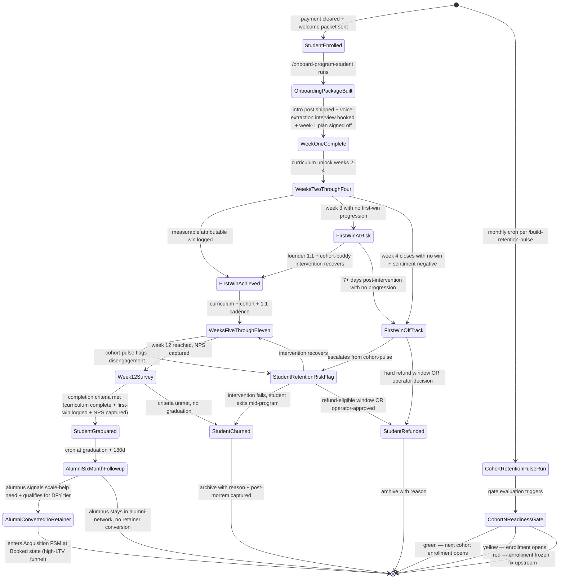

# Program Workflow — FSM

> The state machine for every student entering the high-ticket education program, from "enrolled" through "graduated" through "alumni-converted-to-retainer." Owned by `program-head`. Drives `paperclip.manifest.yaml` cohort triggers and per-student skill execution. Cohort-level states gate the next cohort's enrollment.

## State diagram

## State definitions

| State | Definition | Owner | Auto-transition? |
|---|---|---|---|
| **StudentEnrolled** | Payment cleared, welcome packet auto-sent | program-head | YES — to OnboardingPackageBuilt |
| **OnboardingPackageBuilt** | `/onboard-program-student` has produced onboarding doc + cohort-buddy assigned + community access provisioned | program-mentor | YES — to WeekOneComplete on artifact sign-off |
| **WeekOneComplete** | Intro post shipped to community, voice-extraction interview booked, week-1 plan operator-signed-off | program-mentor | NO — student-driven |
| **WeeksTwoThroughFour** | Curriculum modules 2-4 unlocked; first-win attempts active per `/build-first-win-trigger` | program-mentor | NO — first-win-driven |
| **FirstWinAchieved** | Measurable attributable win logged in `case_studies.program_case_studies` with `proof_assets` path | program-head | YES — to WeeksFiveThroughEleven |
| **FirstWinAtRisk** | Week 3 close with no win-trigger progression; pulse flag raised | program-head + program-mentor | NO — intervention-driven |
| **FirstWinOffTrack** | Week 4 close with no win + negative sentiment OR rejected ≥3 mentorship recommendations | program-head + operator | YES — to StudentRetentionRiskFlag |
| **WeeksFiveThroughEleven** | Curriculum modules 5-11 + weekly cohort call + monthly 1:1 cadence active | program-mentor | NO — cadence-driven |
| **StudentRetentionRiskFlag** | Cohort-pulse flagged disengagement (no source material 7d, sentiment negative, mentorship rejected) | program-head | NO — intervention-driven |
| **Week12Survey** | Week 12 reached, NPS + completion criteria captured | program-head | YES — to StudentGraduated OR StudentChurned |
| **StudentGraduated** | Curriculum complete + first-win logged + NPS captured + graduation artifact in `case_studies.program_case_studies` with `use_in_sales` flag pending | program-head | NO — alumni-cron-driven |
| **StudentRefunded** | Refund processed inside refund-eligible window OR operator-approved goodwill refund | program-head + operator | YES — archive |
| **StudentChurned** | Mid-program exit OR week 12 criteria unmet, no refund | program-head + operator | YES — archive with post-mortem |
| **AlumniSixMonthFollowup** | 180-day post-graduation outreach per alumni-nurture cadence | program-head | NO — alumnus-driven |
| **AlumniConvertedToRetainer** | Alumnus signals scale-help, qualifies for DFY tier; high-LTV funnel | program-head + acquisition-head | YES — exits to Acquisition FSM at Booked |
| **CohortRetentionPulseRun** | `/build-retention-pulse` has executed (monthly per paperclip cron) | program-head | YES — to CohortNReadinessGate |
| **CohortNReadinessGate** | Gate evaluation: green/yellow/red against first-win rate, NPS, churn count, case-study density | program-head + agency-director | NO — gates next cohort enrollment |

## Triggers (cross-reference to paperclip.manifest.yaml)

- `case_studies.program_case_studies.added` (event: `new-program-student-enrolled`) → StudentEnrolled state, fires `/onboard-program-student`
- `weekly-program-cohort-pulse` (cron: Sunday 10:00) → fires `/program-cohort-pulse`, surfaces FirstWinAtRisk + StudentRetentionRiskFlag transitions
- `program.first-win.logged` (event) → moves WeeksTwoThroughFour or FirstWinAtRisk → FirstWinAchieved
- `program.week-12.reached` (cron per cohort) → moves WeeksFiveThroughEleven → Week12Survey
- `program.graduation.plus-180d` (cron per graduate) → moves StudentGraduated → AlumniSixMonthFollowup
- monthly retention-pulse (cron) → CohortRetentionPulseRun → CohortNReadinessGate

## Owner-by-state escalation

States where the operator MUST be in the loop (per `INVARIANTS.md` A-13 and program-head decision authority):

- FirstWinOffTrack → operator confirms intervention vs. refund path
- StudentRefunded (operator countersigns refund decision)
- StudentChurned (operator + program-head consult on mid-program removal per program-head decision authority)
- AlumniConvertedToRetainer (operator-led close on high-LTV transition)
- CohortNReadinessGate yellow/red verdict (operator + agency-director gate next cohort)

All other states can run on workspace + program-mentor with operator review only on graduation artifacts.

## Health metrics by state

| Stage | Metric | Healthy range | Action if below |
|---|---|---|---|
| OnboardingPackageBuilt | Time from StudentEnrolled to package ship | <72 hours | Audit `/onboard-program-student` runtime + cohort-buddy assignment latency |
| WeekOneComplete | Voice-extraction interview booked rate | ≥90% | Audit calendar friction + welcome-packet CTA |
| WeeksTwoThroughFour → FirstWinAchieved | First-win-by-week-3 rate | ≥70% per cohort | Re-run `/build-first-win-trigger` calibration; check selection asymmetry |
| WeeksFiveThroughEleven | Active engagement rate (source material + mentorship attendance) | ≥80% weekly | Cohort-pulse intervention triggers; re-pair cohort-buddies |
| StudentRetentionRiskFlag | Recovery rate (back to active state) | ≥60% | Audit intervention playbook; escalate to founder 1:1 sooner |
| Week12Survey → StudentGraduated | Graduation rate | ≥75% per cohort | Audit selection (program application hard-DQ); audit curriculum sequencing |
| StudentGraduated | NPS at week 12 | ≥50 | Audit transformation evidence vs. expectation set in sales |
| AlumniSixMonthFollowup → AlumniConvertedToRetainer | Conversion to DFY retainer | 10-20% | Audit alumni-nurture content; check retainer offer-fit for graduate stage |
| CohortNReadinessGate | Green-verdict frequency | ≥80% of pulses | Yellow/red recurring → freeze enrollment; foundations-head + program-head joint diagnostic |
| StudentRefunded + StudentChurned (combined) | Total per cohort | ≤20% | Selection asymmetry per program-head failure-modes; sharpen application gate |

## Cross-references

- `agents/program-head.md` — owner of this FSM
- `agents/program-mentor.md` — runs the per-student state portion
- `skills/onboard-program-student/SKILL.md` — StudentEnrolled → OnboardingPackageBuilt → WeekOneComplete
- `skills/build-first-win-trigger/SKILL.md` — first-win engineering for WeeksTwoThroughFour
- `skills/program-cohort-pulse/SKILL.md` — weekly pulse driving StudentRetentionRiskFlag transitions
- `skills/build-retention-pulse/SKILL.md` — monthly pulse driving CohortRetentionPulseRun
- `skills/build-curriculum/SKILL.md` — curriculum that gates module unlocks
- `reference/playbooks/hybrid-full-stack.md` Phase 3 — program tier launch context
- `reference/frameworks/program/first-win-engineering.md` — first-win trigger primitive
- `reference/frameworks/program/cohort-pulse-protocol.md` — pulse cadence + intervention logic
- `paperclip.manifest.yaml` — `weekly-program-cohort-pulse` cron + `new-program-student-enrolled` event
- `INVARIANTS.md` A-13 — operator-only on hard-DQ application overrides (selection gate)
- `workflows/divisions/acquisition.md` — AlumniConvertedToRetainer hands off to Acquisition FSM at Booked

---

*Workflow version 1.0.0 — 2026-05-03*
